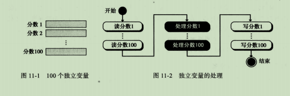

# 计算机科学导论

## 第八章 算法

### 8.1 概念

#### 非正式定义

* 算法是一种逐步解决问题或完成任务的方法
  * 按照这种定义，算法完全独立于计算机系统
  * 算法接收一组输入数据，同时产生一组输出数据

#### 正式定义

* 算法是一组明确步骤的有序集合，它产生结果并在有限的时间内终止

#### 求最大值算法

> 接收一组5个整数作为输入，然后输出其中的最大值

* 输入
  * 这个算法需要输入一组的5个整数
* 过程
  * 在这个算法中为求最大值采取5个步骤
* 定义动作
* 细化
  * 初始化
  * 判断
* 泛化
  * 循环

### 8.2 三种结构

> 计算机专家为结构化程序或算法定义了三种结构
>
> 顺序、判断（选择）、循环

#### UML

* 统一建模语言（UML）是算法的图形表示法
* 使用“大图”的形式掩盖了算法的所有细节，只显示算法从开始到结束的整个流程

### 8.5 基本算法

* 求和
* 乘积
* 最大和最小
* 排序
  * 选择排序
  * 冒泡排序
  * 插入排序
* 查找
  * 顺序查找
  * 折半查找

#### 求和

> 在循环中使用加法操作，实现一系列整数相加

* 将和\(sum\)初始化
* 循环，在每次迭代中将一个新数加到和\(sum\)上
* 退出循环后返回结果

#### 乘积

> 在循环中使用乘法操作

* 将乘积\(product\)初始化
* 循环，在每次迭代中将一个新数与乘积\(product\)相乘
* 退出循环后返回结果

#### 最大和最小

> 最大：通过一个判断结构求到两个数中的较大值，把此结构放在循环中，就可以求出一组数中的最大值
>
> 最小：与上面方法类似，但判断结构求出的是最小值，初始化时使用一个很大而不是非常小的整数

#### 选择排序

> [1.2 选择排序 \_ 菜鸟教程](https://www.runoob.com/w3cnote/selection-sort.html)
>
> [1.0 十大经典排序算法 \_ 菜鸟教程](https://www.runoob.com/w3cnote/ten-sorting-algorithm.html)
>
> [选择排序入门详解 - CodePlayer](https://codeplayer.vip/p/j7sbj)

> 选择排序算法：使用两重循环，外层循环每次扫描时迭代一次，内层循环在未排序列表中求最小的元素

[1.2 选择排序 \_ 菜鸟教程](https://www.runoob.com/w3cnote/selection-sort.html) 详解

* 前期准备
  * 条件1：总共有多少个数据
    * var 获取最大数组最大长度5
  * 条件2：定义第三方中转元素
    * minIndex：中转的位置
    * temp：中转的数据
* 外层循环控制 **比对完成组**
  * 每次比对的起点为i
  * 进入外层循环，外层循环次数为最大次数-1
    * i=0，i小于5并且减一
    * 把i赋值给minIndex，表示数组中第1个位置，目前minIndex=0
* 内层循环控制_**正在比对组**_
  * 每次比对的起点为i+1，即 **比对完成组** 以外
  * ①.进入内层循环，并把i+1赋值给j，目前j=1，内层循环次数为5次
    * 进入判断，如果arr数组中的第二个位置的数字（8） 小于 第一个位置的数字（9），则把minIndex的位置换成第二个位置的（8）\[1\]
  * ②.回到内层循环，j++，j=2
    * 重新进入判断，如果arr数组中的第三个位置的数字（7） 小于 第二个位置的数字（8），则把minIndex的位置换成第三个位置的（7）\[2\]
  * ③.回到内层循环，j++，j=3
    * 重新进入判断，如果arr数组中的第四个位置的数字（6） 小于 第三个位置的数字（7），则把minIndex的位置换成第四个位置的（6）\[3\]
  * ④.回到内层循环，j++，j=4
    * 重新进入判断，如果arr数组中的第五个位置的数字（5） 小于 第三个位置的数字（6），则把minIndex的位置换成第四个位置的（5）\[4\]
  * ⑤.回到内层循环，j++，j=5
  * 内层循环不满足条件，j此时等于5不小于5，跳出内层循环
* 比对结束，开始换位
  * 换位前，第三方中转接收被换位的变量
    * 把arr\[i\]，此时i=0，也就是arr的第一个数字（9），赋值给temp，temp=9
  * 换位
    * 把arr\[minIndex\]，此时minIndex=4，arr的第五个，也是最后一个数字（5），赋值给arr\[i\]，此时i=0，也就是arr的第一个数字（9）
      * 现在，temp（第三方接收）=9，arr中，第一个数字是5，最后一个是5
  * 中转更新转移变量的位置
    * 把temp赋值给arr\[minIndex\]，也就是最后一个数字的位置（目前是5）
      * 现在，temp（第三方接收）=9，arr中，第一个数字是5，最后一个是9

总结

* 由于是两两相比对，所以次数为最大个数减一
* 替换操作，由第三方中转
  * 定义一个变量minIndex，临时存放替换的位置
  * 定义一个变量，临时存放被替换的数据
* 每循环比对一次，就把最小值放到**比对完成组**的最后面
  * 由于第一次及每次都是当前所有数值的最小值，所以不会发生**比对完成组**里面再比对的情况发生

## 第11章：数据结构

### 11.1数组

> 数组是元素的 _**顺序**_ 集合，数组使得循环变得容易
>
> 当需要进行的插入和删除操作数目较少，而需要大量的查找和检索操作时，数组是合适的结构

#### 数组解决的问题

### 11.2 记录

> 记录是一组相关元素的集合，他们可能是不同的类型，但整个记录有一个名称

* 记录中的每个元素称为 域
* 域是具有含意的最小命名数据
* 它有类型，且存在于内存中
* 它能被赋值，也能够被选择和操纵
* **域不同于变量，主要在于它是记录的一部分**

