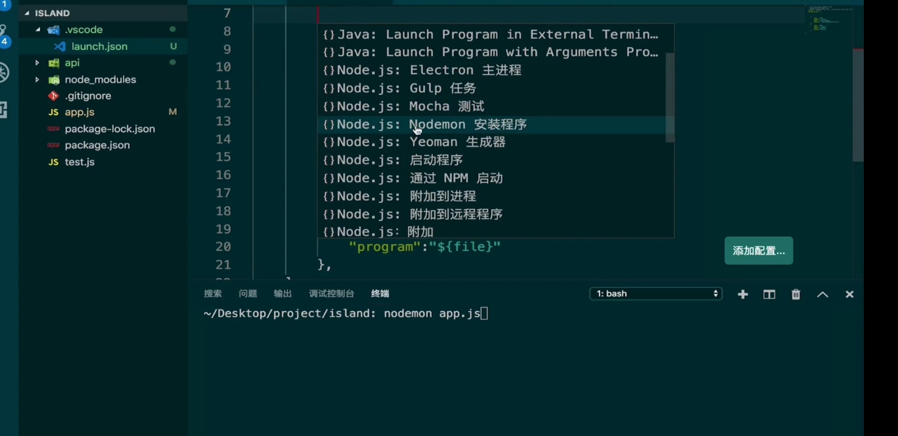

# koa2

## 基础

### npm

* 在终端中定位到项目文件夹
* 执行init命令，初始化项目的npm配置
* 执行install命令安装koa等
* 使用npm install 可安装 package.json 下 “dependencies” 中的所有包

### Koa

* 精简
* 定制化能力强

### Babel

* [Babel 是什么？](https://www.babeljs.cn/docs/index.html)

### Ecma TC39

* [https://github.com/tc39](https://github.com/tc39)

### VS code中的断点调试

* F9设置断点
* F5启动断点调试
* 配置断点调试启动方式

### Node server自动重启

* 使用nodemon
* 使用nodemon启动server
  * 如 nodemon app.js
* 非全局安装使用npx nodemon命令运行，[npx 使用教程](http://www.ruanyifeng.com/blog/2019/02/npx.html)
  * 或者转换成npm脚本

#### 自动重启与断点调试结合



## ES6

### static

> [static - JavaScript \| MDN](https://developer.mozilla.org/zh-CN/docs/Web/JavaScript/Reference/Classes/static)
>
> [Class 的基本语法 - ECMAScript 6入门 - 静态方法](https://es6.ruanyifeng.com/?search=static&x=0&y=0#docs/class#%E9%9D%99%E6%80%81%E6%96%B9%E6%B3%95)

*  类（class）通过 **static** 关键字定义静态方法。不能在类的实例上调用静态方法，而应该通过类本身调用。这些通常是实用程序方法，例如创建或克隆对象的功能。

## Koa基本使用

> [Koa -- 基于 Node.js 平台的下一代 web 开发框架](https://koa.bootcss.com/)

### 基础

* 导入

```javascript
const Koa = require('koa')2.
```

* 实例化

```javascript
//new 出的实例称之为 应用程序对象
const app = new Koa()
```

* 应用程序对象
  * 特点：在对象中包含多个中间件


* 调用 listen \( \)，启动koa框架
  * 传入端口号，注意不要使用被占用的

```javascript
app.listen(3000)
```

* 在终端中启动app.js
  * 类似卡顿的现象代表阻塞状态（监听）
  * ctrl+c  结束状态

```javascript
node app.js
```

## 接收HTTP请求

### 中间件

* 中间件就是是一个普通函数
* 中间件需要注册才能使用

```javascript
//使用use方法注册中间件
app.use(test)
```

* 使用匿名函数注册中间件

```javascript
app.use(()=>{
    console.log{'hello'}
})
```

* koa只会调用第一顺序的中间件
* 其他中间件需要开发者自己调用
  * koa在调用中间件时，会传入两个参数
  * ctx：上下文；next：下一个中间件
  * 使用next\( \)即可调用下一个中间件

```javascript
app.use((ctx,next)=>{
    console.log{'hello2'}
    next()
})

app.use(()=>{
    console.log('hello3')
})
```

### 使用中间件需要注意

* 中间件函数前面一定要加上async
  * 加不加async返回的都是一个promise
  * 之所以加是因为这个中间件函数的内部使用了await，如果不加async是会报错的
* next\( \)前面一定要加上await
* async和await是异步编程的终极解决方案
* 如果不加，会很难保证所有的中间件都按照洋葱模型执行
  * 在每一个中间件调用的下一个中间件的时候，next \( \)前面一定要加上await

```javascript
app.use( async (ctx,next)=>{
    console.log{'hello2'}
    await next()
})
```

#### 访问本地服务器

* 使用node命令启动js文件
* [http://localhost:3000/](http://localhost:3000/)
* 3000为自己设定的端口号

### 洋葱模型

* [koa洋葱模型原理和co原理](https://zhuanlan.zhihu.com/p/112750775)

#### 为什么一定要保证是洋葱模型

* 洋葱是以next\( \)为分界线的
* next \( \)之前的代码说明后续的中间件还没有开始执行
* next \( \)之后的代码表明这些所有的中间件已经执行完毕

#### 不按照洋葱模型执行会引起什么样的情况

* ctx：上下文的作用
  * koa中的操作基本都是在操作ctx（context）
  * 比如常见的操作：两个中间件或者多个中间件之间传递参数
    * 如使用return的方式，可以获得传参结果，但有局限性
    * 局限性在于能够完全掌控所有传参的中间件
    * 但koa过于精简，需要用到大量的第三方中间件
    * 但第三方中间件的执行顺序是不可控的
    * 这种情况下就不能使用return，需要利用ctx
  * 每一个中间件函数在执行的时候都会被注入一个ctx
  * 把获取到的res保存到ctx上
  * 调用时必须在await之后，才能保证洋葱模型
  * 如不保证洋葱模型，将返回undefined

## \*async await

* next\( \)的调用结果一定是一个promise
* 但使用then方法接收promise不够直观
* 使用await可改善此情况
* 使用await以后，前面必须使用async，否则会报错

### await的意义

* 求值关键字
  * 会把promise执行成功后的res返回给常量a
  * await可对表达式进行求值，不仅仅使用在promise上


* await会阻塞当前的线程
  * 当await后面调用的是一个异步函数时
    * 异步操作：对资源的操作一般都是异步请求，如读文件、发送http请求、操作数据库
  * 等待的意义
    * 可以把难以处理的异步函数的调用变为同步的
      * 因为当前的线程被阻塞后，必须要得到最终的返回结果，才能执行后续的代码
  * 虽然会阻塞当前的线程，但不会卡住，线程可以切换到别处去运行别的代码


* 直接返回html的原理
  * axios.get 会返回一个promise
  * await用求值的特性会把这个promise给计算出来，同时也会把当前的线程阻塞

#### 

* await对异步编程的意义
  * 添加await后，使本来是异步的调用变为同步的调用


### await与异常

#### await可以释放promise中的异常

* 不用throw，也可以使用try catch捕获异常
* 如果不使用await，则会产生一个未处理的异常，抛出Unhandled promise 
  * 代表在promise中产生了一个异常，但在外部却没有处理

#### 注意

* async await是最简单的处理异步异常的方案
* 其他方案
  * 通过取到promise，使用promise catch处理

## 

### async的意义

* 如果在一个函数的前面加上了async，那么这个函数任何的返回值都会被包装成一个promise

## 

### 注意

* async和await这种语法，或者说是对异步的处理特性，并不是JavaScript独有的，也不是JavaScript原创的
* 最早出现在微软的c\#语言中


## 路由

#### [请求\(Request\)](https://koa.bootcss.com/#request)

#### [Request 别名](https://koa.bootcss.com/)

* 请求方式默认是GET
* 使用 ctx.path 获取请求路径名
* 使用 ctx.body 返回响应
* 但一般使用json对象的形式

### Koa router

> #### _第三方库_ [_koa_-_router_ - npm](https://www.npmjs.com/package/koa-router)

#### 基本使用

* 导入 koa - router
* 实例化 router
* 调用 router 的 get \( \) 或 post \( \) 等方法 [router.get\|put\|post\|patch\|delete\|del](https://github.com/koajs/router/blob/HEAD/API.md#routergetputpostpatchdeletedel--router)，编写路由函数
  * get 方法接收两个参数
    * 第一个参数：指明这个路由函数所对应的地址是什么
    * 第二个参数：需要传入一个函数，当 koa-router 监听到用户当前访问的 url 地址与第一个参数设置的地址一致时，会自动调用这个函数，此函数可写成匿名函数
      * 虽然第二个参数是一个函数，但实质上也是一个中间件，所以可以接收 ctx 以及 next 两个参数
* 使用 app.use \( \) 把 router 调用 [routes \( \)](https://github.com/koajs/router/blob/HEAD/API.md#module_koa-router--Router+routes) 方法 得到的中间件注册到 app 上面
  * 中间件一定是要注册的，但不一定要开发者自己注册，如 get 方法的第二个参数，是由 koa-router内部自动注册的

### \*\*\*\*[**REST API 是什么？**](https://blog.csdn.net/D_R_L_T/article/details/82562902)\*\*\*\*

## 

### 主题与模型划分

* 划分方式可根据数据的类型来划分
* 主题与主题之间并不是绝对孤立的
* 对主题的划分直接影响了如何设计项目的数据库
* 对主题的划分是渐进式的，首先先找到核心主题

### 拆分路由

#### API版本

* 应对业务变更
* 如何支持
  * 客户端发送API请求时，需要携带版本号
    * 版本号携带策略
    * 加在url路径中
    * 加在查询参数中
    * 加在HTTP的header中
* 多个版本API区分
  * 一个路由函数还是分开
  * 一个路由函数
    * 会让函数的逻辑变得复杂
  * 开闭原则 [设计模式六大原则：开闭原则](https://www.cnblogs.com/az4215/p/11489712.html)
    * 在编程时，对代码的修改是关闭的
    * 对代码的扩展是开放的
  * 所以应该对每一个版本的API都去写一个路由

### 路由的自动注册

#### 自动注册的原理

* 自动导入模块
* 自动使用use方法注册

#### require-directory的使用

> [require-directory](https://www.npmjs.com/package/require-directory)

* 导入requireDirectory
* 不需要实例化，直接使用requireDirectory \( 参数1，参数2，参数3 \)
  * 参数1：module
  * 参数2：被导入模块目录的路径
  * 参数3：是一个对象，含有一个visit属性，此属性可以被赋值一个回调函数
    * 此回调函数可以在每当requireDirectory加载到模块的时候，自动调用
    * 此回调函数可以接收一个参数，在函数中判断此参数是否是一个Router
* 定义接收requireDirectory的变量，接收返回结果
* 循环遍历注册

#### 扩展

* 目前的whenLoadModule函数只兼容router不加{ }的导出模式
* 可以进一步加强此函数，兼容两种模式

## 

### 初始化管理器与Process

> [require-directory](https://www.npmjs.com/package/require-directory)

#### Process获取绝对路径

* process.cwd

## 

### koa参数获取

#### PostMan的使用

> [Postman \| The Collaboration Platform for API Development](https://www.postman.com/)

#### 常用传参模式

* url 路径中传参
* url 的?后传参
* HTTP的header中传参
* HTTP的body中传参（只可使用post）
  * 使用第三方库 [koa-bodyparser](https://www.npmjs.com/package/koa-bodyparser) 来获取
  * koa-bodyparser是一个中间件，首先需要注册
    * parser\( \)需要被调用后才能返回一个中间件

## 异常处理

### 函数设计

* 函数的异常处理
  * 在函数的内部判断出异常，然后return false或者null（不推荐）
    * 有可能会丢失异常信息
  * throw 抛出异常
* 正确的异常处理
  * try catch，在catch中throw 抛出异常
* 全局异常处理
  * 机制
    * 监听任何异常
* 异步异常处理
  * try catch更适用于同步异常，有可能会捕捉不到异步异常

### 全局异常处理

* 使用koa的特色 —— 中间件，来实现全局异常处理
  * 监听错误
  * 监听到后，输出一段有意义的提示信息
* 使用到的思想
  * AOP：面向切面

### 已知错误、未知错误

* 上述全局异常处理的问题
* 在程序中捕捉到的error，不应该直接返回到客户端去
  * 因为error的信息量很大
  * 除了包含常见的error信息，如：错误的名称，错误的原因
  * 还包括一些复杂的信息，如：堆栈调用的信息
  * 所以要对error简化，返回一些清晰明了的信息到客户端
* 应该给客户端返回哪些信息
  * HTTP Status Code，[指定HTTP常见的状态码](https://koa.bootcss.com/#response)（如2XX、4XX、5XX）
    * 在koa中，如果要指定一次请求返回结果的HTTP Status Code，可以通过设置上下文ctx变量上面属性来实现
  * 开发者自定义信息
    * message：错误信息
    * error\_code：更详细的错误代码（如 10001 20003）
    * request url：访问的url

#### 已知型错误

* 用户传入的参数不符合校验规则

#### 未知型错误

* 程序潜在错误
  * 无意识错误
  * 或根本不知道错误已经发生
  * 如：连接数据库

### 特定异常类与global全局变量

* 改善上述HttpException异常基类在使用时，每次都需要传入msg，errorCode、code
* 使用全局变量global来改善每次都需要导入异常中间件的问题
  * 但不推荐
  * 拼错单词导致的异常不明确，不容易排查

```javascript
class InitManager{
    static initCore(app){
        //入口方法
        InitManager.loadHttpException()
    }

    static loadHttpException(){
        const errors = require('./http-exception')
        global.errs = errors
    }
}

module.exports = InitManager
```

###  Lodash库的使用 - Lin-Validator获取HTTP参数

> [Lodash 中文文档](https://www.lodashjs.com/)
>
> [Lodash Documentation](https://lodash.com/docs/4.17.15)

* get方法的原理
* JS库 - lodash

  * 提供对数组、函数、日期、集合等数据结构的操作
  * 深拷贝：[cloneDeep](https://www.lodashjs.com/docs/lodash.cloneDeep)

* isInt的原理
* 第三方库 - validator.js
  * [Validator.js验证工具](http://wangchujiang.com/validator.js/)
  * [validate.js](https://validatejs.org/)
  * [validator - npm](https://www.npmjs.com/package/validator)

### 数据库 - 用户系统设计

> [XAMPP Installers and Downloads for Apache Friends](https://www.apachefriends.org/index.html)

#### 用户系统

* 通用用户系统
  * 帐号、密码
    * 附属信息：昵称、email、手机
  * 注册
    * 注册的信息提交到API中，存储到数据库中
  * 登录
* 小程序用户系统

#### 关系型数据库

* My SQL、Oracle、SQL  Server、Postgress SQL
* 本项目通过ORM操作数据库
  * 类似在对象上调用了一个方法

#### 非关系型数据库

* Redis（Key : value）
  * 更多用来做缓存使用，提高查询及获取数据的速度
  * 也可作为持久存储数据使用
* MongDB（文档型数据库）
* 相对于ORM，非关系型数据库可以使用ODM的模式操作数据库

